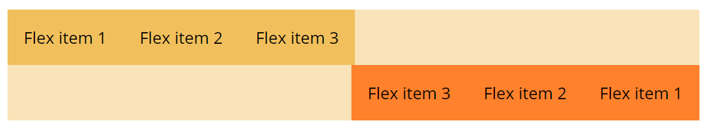
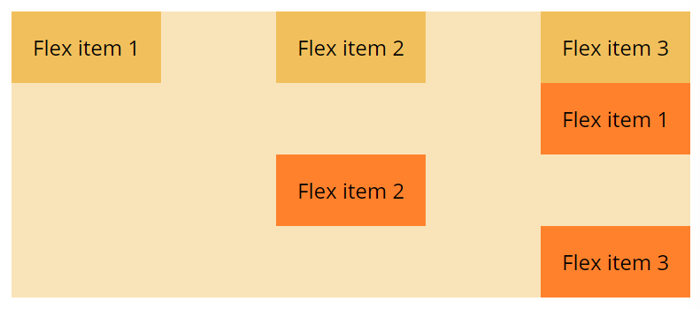
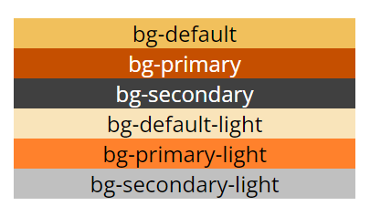
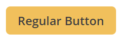
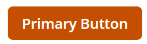
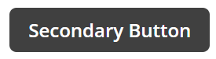
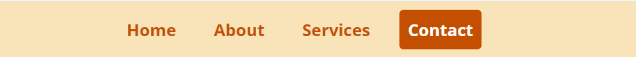
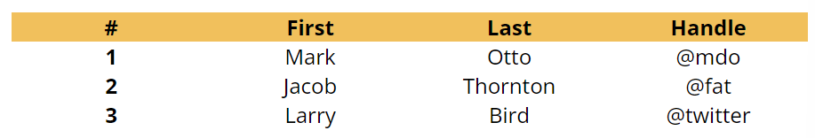

# Bow Tie CSS

The CSS framework "Bow Tie CSS" streamlines and accelerates the coding process by offering a collection of pre-designed, visually cohesive elements. Tailored for simplicity and speed, "Bow Tie CSS" furnishes users with fundamental yet visually appealing components, enabling rapid development while ensuring consistency across designs.

## Get Started/Installation

[Download bowtie.css](css/main.css), add it to your project, and get started right away by using as described below.

## Usage

### Layout

#### Media Queries/Breakpoints
Bow Tie CSS uses the following breakpoints in our source Sass files for our layout, grid system, and components. **Note**: Small Screen Size (less than 768px) is our default breakpoint.

For Medium Screen Size (768px and up):
```
@media (min-width: 768px) { @content; }
```

For Large Screen Size (1200px and up):
```
@media (min-width: 1200px) { @content; }
```

All our media queries are available via Sass mixins:
```
@include media-queries.md-screen-size { ... }
@include media-queries.lg-screen-size { ... }
```

Example: Display the div as a block on small screen size, and then display it as an inline-block on medium screen size:
```
div {
    display: block;
}
@include media-queries.md-screen-size {
    display: inline-block;
}
```

#### Containers

Bow Tie primary uses two types of container classes:

- `.container` for a fixed-width container, of which the max-width changes at each breakpoint:
```
<div class="container">
    <!--- Content Here --->
</div>
```

- `.container-fluid` for the width of 100% on all breakpoints:
```
<div class="container-fluid">
    <!--- Content Here --->
</div>
```

#### Grid
Bow Tie's grid system employs a sequence of containers, rows, and columns to organize and position content effectively. Utilizing CSS grid, it is fully responsive. Below, we provide an example to show how Bow Tie grid works.


(Code)
```
<div class="container bg-default-light">
    <div class="row grid-gap-lg">
        <div class="col-6 bg-default">
        1 of 2
        </div>
        <div class="col-6 bg-default">
        2 of 2
        </div>
    </div>
    <div class="row grid-gap-md">
        <div class="col-4 bg-primary-light">
        1 of 3
        </div>
        <div class="col-4 bg-primary-light">
        2 of 3
        </div>
        <div class="col-4 bg-primary-light">
        3 of 3
        </div>
    </div>
</div>
```
How it works:
- `.container` serve as a means to center the contents of your site. You can employ `.container` for a responsive pixel width or `.container-fluid` for a width of 100% across all screen sizes.
- `.row`are wrappers for columns. Each row contains 12 equal-sized columns.
- Column classes specify the number of columns you wish to utilize out of the possible 12 columns per row. For example, if you desire three equal-width columns across, you can utilize three `.col-4`.
- Use `.col-{breakpoint}-*` classes to size the columns on different screen sizes. For example, if you desire three equal-width columns across on small screen size (default) and four equal-width columns across on medium screen size, you can utilize `.col-4` with `.col-md-3`.
- Grid Gap classes are used to determine the horizontal spacing between columns. Bow Tie provides three grid gap sizes by default:
    - `.grid-gap-0`
    - `.grid-gap-sm`
    - `.grid-gap-md`
    - `.grid-gap-lg`

#### Display Options
Bow Tie has six classes for different display options:
- `.d-inline`
- `.d-block`
- `.d-inline-block`
- `.d-flex`
- `.d-inline-flex`
- `.d-none`

Use `.d-{breakpoint}-*` classes to utilize different display options on different screen sizes. For example, if you desire no display on small screen size (default) and block display on medium screen size, you can utilize `.d-none` with `.d-md-block`.

#### Flexbox
Use `.d-flex`, `.d-inline-flex` or one of the responsive variants (e.g., `.d-md-flex`, `.d-lg-inline-flex`) to utilize flexbox display on elements. **Note:** You will need one fo these classes in order to utilize our extra flexbox utilities for spacing, sizing, alignment, and more.
- Flex Direction
    - `.flex-row` sets a horizontal direction.
    - `.flex-row-reverse` starts a horizontal direction from the opposite side.
    - `.flex-column` sets a vertical direction.
    - `.flex-column-reverse` starts a vertical direction from the opposite side.
    - Use the resposive variants (`.flex-{breakpoint}-*`) to set flex-direction for different screen size.

Example:


(Code)
```
<div class="d-flex flex-row mx-3 bg-default-light">
    <div class="p-2 bg-default">Flex item 1</div>
    <div class="p-2 bg-default">Flex item 2</div>
    <div class="p-2 bg-default">Flex item 3</div>
</div>
<div class="d-flex flex-row-reverse mx-3 bg-default-light mb-3">
    <div class="p-2 bg-primary-light">Flex item 1</div>
    <div class="p-2 bg-primary-light">Flex item 2</div>
    <div class="p-2 bg-primary-light">Flex item 3</div>
</div>
```

#### Flexbos & Grid Alignment
The following alignment classes work withboth flexbox and grid system:

- `.justify-content`
    - Controls the alignment of flex items along the main axis of the flex container.
    - Controls the alignment of grid items along the inline (row) axis of the grid container.
        - `.justify-content-start`
        - `.justify-content-end`
        - `.justify-content-center`
        - `.justify-content-between`
        - `.justify-content-around`
- `.align-items`
    - Controls the alignment of flex items along the cross axis of the flex container.
    - Controls the alignment of grid items along the block (column) axis of the grid container.
        - `align-items-start`
        - `align-items-end`
        - `align-items-center`
        - `align-items-between`
        - `align-items-around`
- `.align-self`
    - Allows individual flex items or grid items to override the alignment set by `.align-items`.
        - `align-self-start`
        - `align-self-end`
        - `align-self-center`
        - `align-self-between`
        - `align-self-around`

Use the responsive variants (`.justify-content-{breakpoint}-*`, `.align-items-{breakpoint}-*`, `.align-self-{breakpoint}-*`) to set alignment on different screen sizes.

Example:


(Code)
```
<div class="d-flex flex-row justify-content-between mx-3 bg-default-light">
    <div class="p-2 bg-default">Flex item 1</div>
    <div class="p-2 bg-default">Flex item 2</div>
    <div class="p-2 bg-default">Flex item 3</div>
</div>
<div class="d-flex flex-column align-items-end mx-3 bg-default-light mb-3">
    <div class="p-2 bg-primary-light">Flex item 1</div>
    <div class="p-2 align-self-center bg-primary-light">Flex item 2</div>
    <div class="p-2 bg-primary-light">Flex item 3</div>
</div>
```

#### Margin & Padding
The naming convention for classes follows this structure: `{property}{sides}-{size}` for small screen size and `{property}{sides}-{breakpoint}-{size}`for medium (md), large (lg) screen size.

In this format:
- Property options include:
  - "m" for classes that define margin.
  - "p" for classes that define padding.

- Sides options are:
  - "t" for top.
  - "b" for bottom.
  - "s" for start/left.
  - "e" for end/right.
  - "x" for both left and right.
  - "y" for both top and bottom.
  - Blank for setting margin or padding on all four sides.

- Size choices are:
  - "0" to eliminate margin or padding by setting it to 0.
  - "1" to set margin or padding to 0.5rem.
  - "2" to set margin or padding to 1rem.
  - "3" to set margin or padding to 1.5rem.
  - "auto" to set margin to auto.

#### Width & Height
Use the following classes to control the width and height of elements:
- `.w-25` (width 25%)
- `.w-50` (width 50%)
- `.w-75` (width 75%)
- `.w-100` (width 100%)
- `.w-auto` (width auto)
- `.h-25` (height 25%)
- `.h-50` (height 50%)
- `.h-75` (height 75%)
- `.h-100` (height 100%)
- `.h-auto` (height auto)

#### Text Alignment
Use the following classes to set the text alignment:
  - `.text-left`
  - `.text-right`
  - `.text-justify`
  - `.blockquote`
  - `.blockquote-footer`

Example:


(Code)
```
<blockquote class="blockquote">
    <p>"Here is a blockquote. It might contain some meaningful content."</p>
    <footer class="blockquote-footer">- Someone famous</footer>
</blockquote>
```

#### Float
Use the following classes to apply float display to elements:
- .float-left
- .float-right
- .float-md-left
- .float-md-right
- .float-lg-left
- .float-lg-right

#### Positions
Use the following classes to control the positions of elements:
- .position-static
- .position-relative
- .position-abolute
- .position-fixed
- .position-sticky

### Styling

#### Background Colors
Bow Tie CSS offers six different background colors by default:
- `.bg-default`
- `.bg-primary`
- `.bg-secondary`
- `.bg-default-light`
- `.bg-primary-light`
- `.bg-secondary-light`

Example:


(Code)
```
<div class="w-50 mx-auto bg-default text-center">bg-default</div>

<div class="w-50 mx-auto bg-primary text-light text-center">bg-primary</div>

<div class="w-50 mx-auto bg-secondary text-light text-center">bg-secondary</div>

<div class="w-50 mx-auto bg-default-light text-center">bg-default-light</div>

<div class="w-50 mx-auto bg-primary-light text-center">bg-primary-light</div>

<div class="w-50 mx-auto bg-secondary-light text-center mb-3">bg-secondary-light</div>
```

#### Borders
Use the following classes to control the borders of elements:
- Border
    - `.border`
    - `.border`
    - `.border`
    - `.border`
    - `.border`
- Borderless
    - `.border-0`
    - `.border-t`
    - `.border-r`
    - `.border-b`
    - `.border-l`

- Border Colors
    - `.border-defau`
    - `.border-prima`
    - `.border-secon`
    - `.border-white`

- Border Radius
    - `.rounded`
    - `.rounded-top-left`
    - `.rounded-top-right`
    - `.rounded-bottom-left`
    - `.rounded-bottom-right`
    - `.rounded-top`
    - `.rounded-right`
    - `.rounded-bottom`
    - `.rounded-left`
    - `.rounded-0`

#### Shadow
Use the following classes to add shadows of different sizes to elements:
- .shadow-sm
- .shadow
- .shadow-lg

### Components

#### Buttons
Add the button class `btn` to any block level or inline-block level element, and it will display the button style. To add a primary or secondary color, add the class `btn-primary` or `btn-secondary`.

Example (Regular button):


(Code)
```
<button type="button">Regular Button</button>
or
<a class="btn " href="#">Regurlar Button</a>
```

Example (Primary button):


(Code)
```
<a class="btn btn-primary" href="#">Primary Button</a>
```

Example (Secondary button):


(Code)
```
<a class="btn btn-secondary" href="#">Secondary Button</a>
```

#### Navigation Bar
Use the following classes to add and style navigation elements:
-  `.nav`
-  `.nav-item`
-  `.nav-link` (+hover)
-  `.nav-pill`

Example:


(Code)
```
<header>
    <div class="nav-bar bg-default-light">
        <nav class="text-strong">
            <ul>
                <li class="nav-item"><a href="#" class="nav-link">Home</a></li>
                <li class="nav-item"><a href="#" class="nav-link">About</a></li>
                <li class="nav-item"><a href="#" class="nav-link">Services</a></li>
                <li class="nav-item"><a href="#" class="nav-link nav-pill">Contact</a></li>
            </ul>
        </nav>
    </div>
</header>
```

#### Table
Use the following classes to create and style table elements:
- `.table`
- `.table-dark`
- `.table-bordered`
- `.table-borderless`

Example:


(Code)
```
<div class="row mx-3">
    <table class="table col-12">
        <thead class="bg-default">
        <tr>
            <th scope="col" class="col-3">#</th>
            <th scope="col" class="col-3">First</th>
            <th scope="col" class="col-3">Last</th>
            <th scope="col" class="col-3">Handle</th>
        </tr>
        </thead>
        <tbody>
        <tr>
            <th scope="row" class="col-3">1</th>
            <td class="col-3">Mark</td>
            <td class="col-3">Otto</td>
            <td class="col-3">@mdo</td>
        </tr>
        <tr>
            <th scope="row" class="col-3">2</th>
            <td class="col-3">Jacob</td>
            <td class="col-3">Thornton</td>
            <td class="col-3">@fat</td>
        </tr>
        <tr>
            <th scope="row" class="col-3">3</th>
            <td class="col-3">Larry</td>
            <td class="col-3">Bird</td>
            <td class="col-3">@twitter</td>
        </tr>
        </tbody>
    </table>
</div>
```